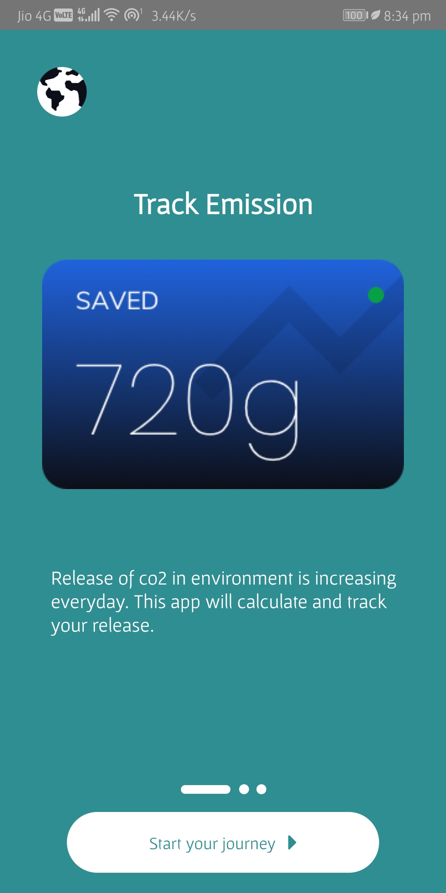
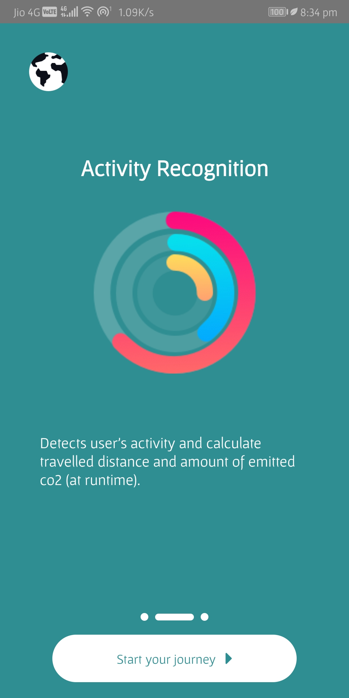
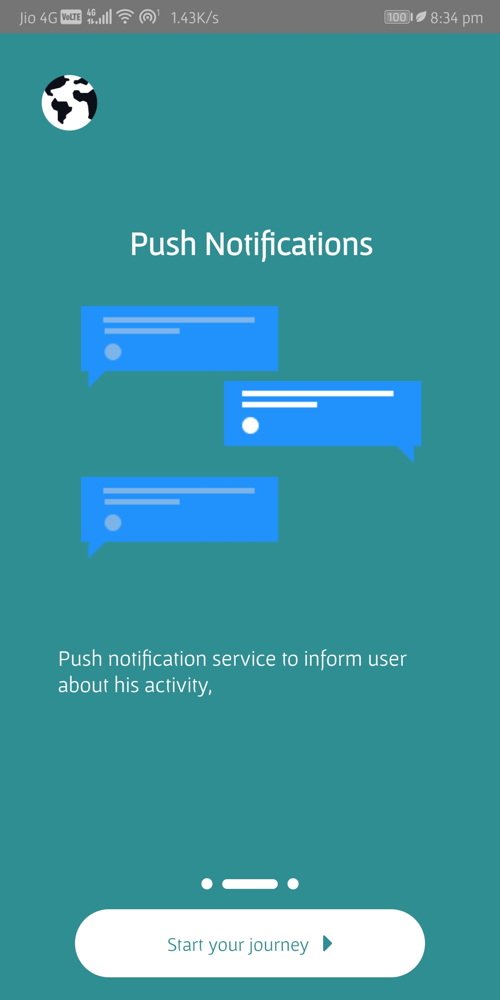
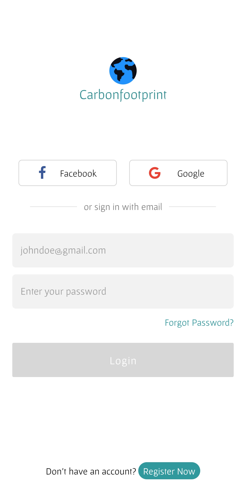
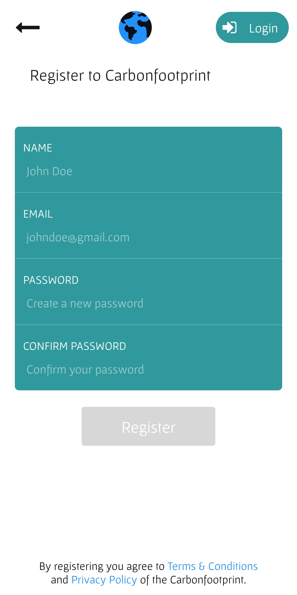
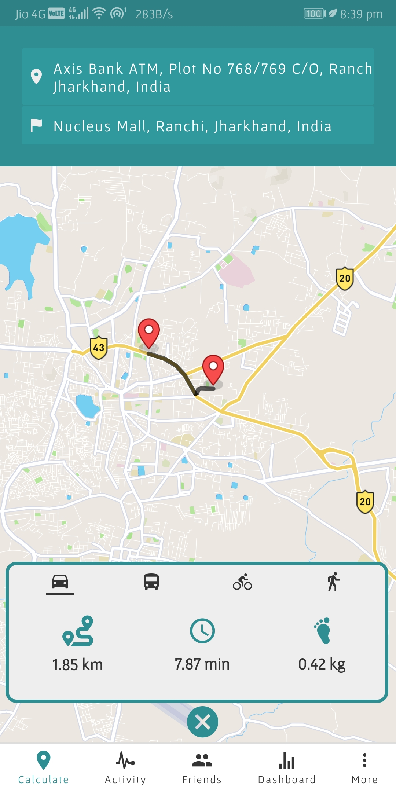
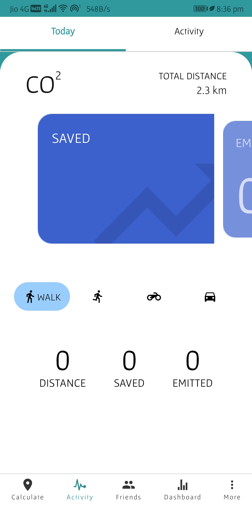
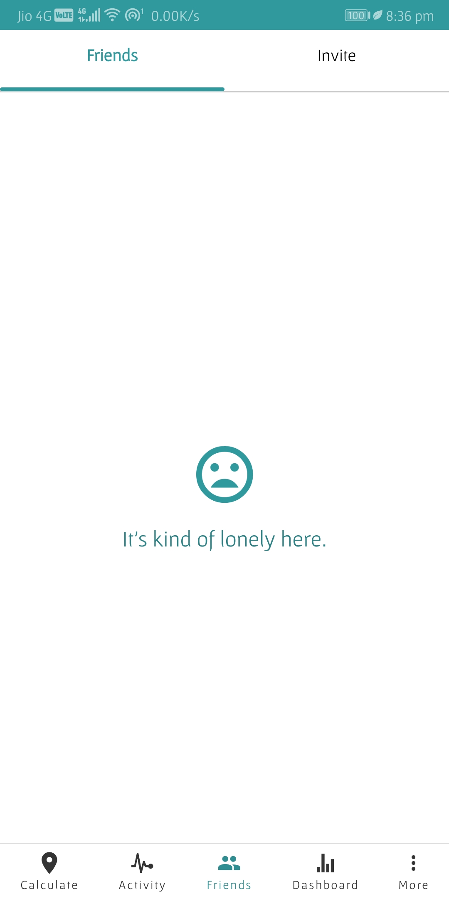
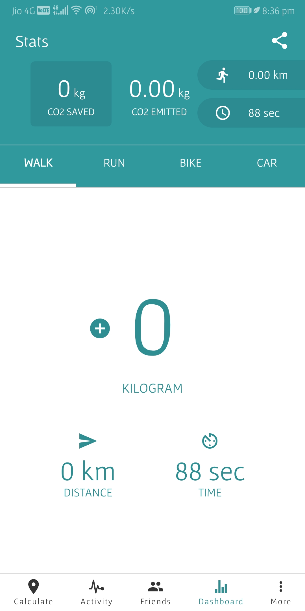
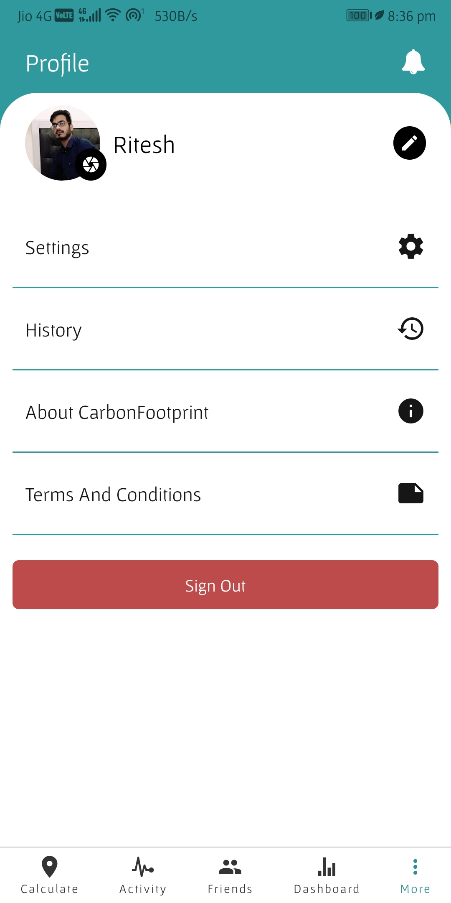

# Carbon Footprint Mobile Application

This project is for Carbon Footprint Mobile Application

[](https://gitlab.com/aossie/CarbonFootprint-Mobile/-/commits/develop)
[](https://gitter.im/AOSSIE/CarbonFootprint-Mobile)

---

#### Screenshots

<table>
    <tr>
     <td><kbd></kbd></td>
     <td><kbd></kbd></td>
     <td><kbd></kbd></td>
     <td><kbd></kbd></td>
     <td><kbd></kbd></td>
     <tr> 
      <td><kbd></kbd></td>
      <td><kbd></kbd></td>
      <td><kbd></kbd></td>
      <td><kbd></kbd></td>
      <td><kbd></kbd></td>
    </tr>
  </table>

---

## About Carbon Footprint Mobile

Carbon Footprint - A mobile app by Australian Open Source Software Innovation and Education (AOSSIE) is a wonderful tool to know about how much carbon we produce. This app measures CO2 emmision when we travel from one location to another, if travel by a car we may have higher CO2 emission as compared when we travel on bike or go there by foot. This helps the user to track fuel emission and hence the amount for CO2 we can save. This is an sincere effort by AOSSIE to create a awareness among us about our environment. This app is easy to use with comfortable user interface and accurately measures the amount of CO2 we save. 

## Install Dependencies

This project is built using React Native.

Follow the guide to install dependencies for :-
* [Windows](doc/dependencies_windows.md)
* [macOs](doc/dependencies_macOS.md)
* [Linux](doc/dependencies_linux.md)

### Setup

1. Install package-dependencies using NPM.

```
npm install
```

> NOTE: node v10.x is recommended.

2. Version conflicts in `node_modules` are resolved in this step.

```
chmod +x ./scripts/fixes.sh ./scripts/fixes-mac.sh
```

If a linux/windows user, run:

```
./scripts/fixes.sh
```

If on a mac, run:

```
./scripts/fixes-mac.sh
```

3. Rename keys.sample.js located in app/config to keys.js.

#### Firebase API key

1.  Go to [Firebase console](https://console.firebase.google.com) and add a new project.
2.  Setup a **Realtime Database** and enable **Crashlytics**.
3.  Go under authentication/sign-in method and enable email/password, google and facebook login.
4.  Add web, android and ios apps in the firebase console.
3.  Copy **Firebase Config** from firebase console and paste it in place of firebaseConfig object in keys.js.
4.  Go to settings/general in the firebase console and download the **google-services.json** file and add it to PROJECT_NAME/android/app

#### MapBox API key

1.  Go to [MapBox](https://account.mapbox.com/access-tokens/create)
2.  Create a new access token.
3.  Copy the API key and paste it in key.js.

#### Facebook SDK

1. Go to [Facebook app](!https://developers.facebook.com/apps/) and register a new app for Carbonfootprint      Oauth.
2. Copy App id from the app setup.

Follow the guide for setting up the project for :- 
* [iOS](doc/setup_ios.md)
* [Android](doc/setup_android.md)

**NOTE -** Please add the SHA-1 certificate fingerprints of your debug and release keystore in project settings in Firebase. To generate SHA-1 certificate fingerprints, see https://developers.google.com/android/guides/client-auth .

**NOTE -** In case of errors faced while installation of the application refer to this [errors-and-fixes](errors-and-fixes.md) file, to resolve the errors.

#### For Tester

For new tester's flexibility [link](https://bit.ly/2DanqQO) to latest apk. Download and Install the latest apk in your mobile phone to test the working of app.
Here is the link to the app's instance running on a remote device [link](https://appetize.io/app/r56q66m2pffqarxgyte8yrjgtr)

Follow [this](doc/setup_testing.md) guide.

### Setting up Pipeline

Follow the guide to [setup pipeline](doc/setup_pipeline.md)

### Enabling ProGuard and Creating seperate APKs for both x86 and ARMv7a CPU architectures

Follow [this](doc/enable_proguard.md) guide.
