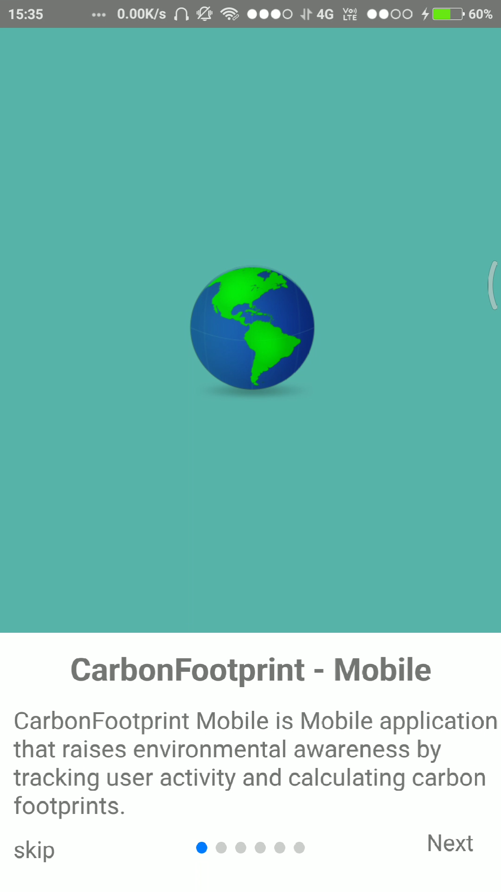
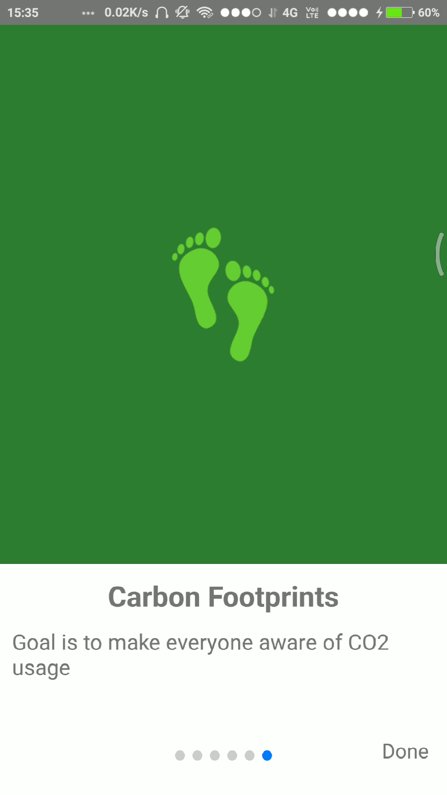
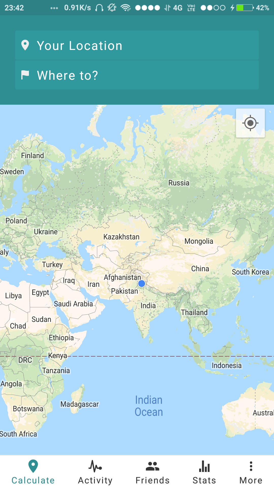
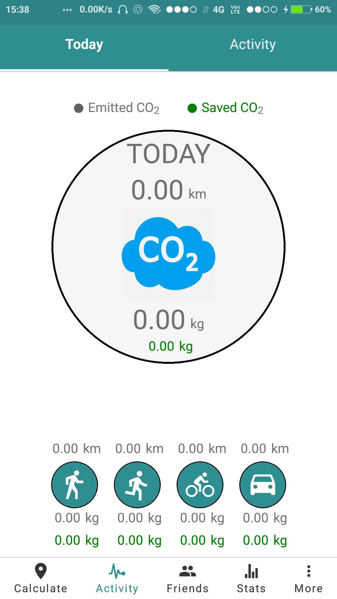
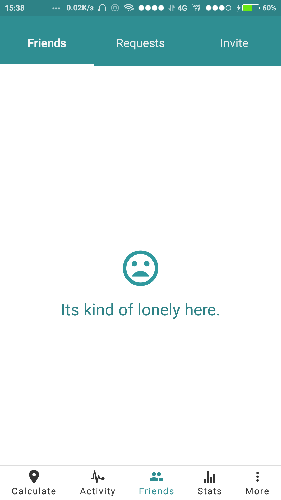
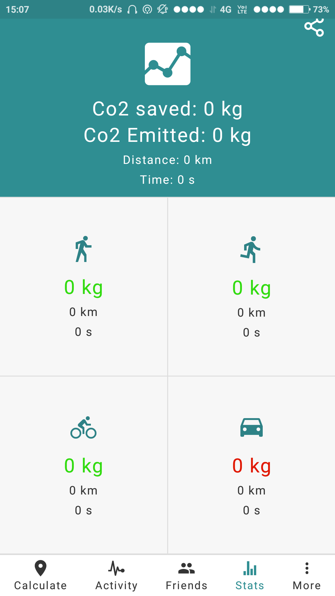
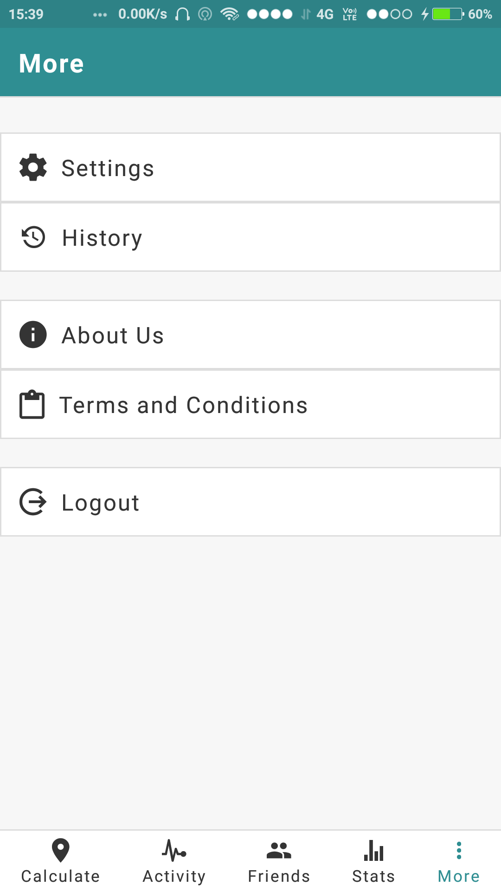

# Carbon Footprint Mobile Application

This project is for Carbon Footprint Mobile Application

---

#### Screenshots

<table>
    <tr>
     <td><kbd></kbd></td>
     <td><kbd></kbd></td>
     <td><kbd></kbd></td>
     <td><kbd></kbd></td>
     <tr> 
      <td><kbd></kbd></td>
      <td><kbd></kbd></td>
      <td><kbd></kbd></td>
      <td><kbd></kbd></td>
    </tr>
  </table>

---

## Install Dependencies

This project is built using React Native. You will need the following dependencies.
You can also follow the [Setup guide for android](#setup-guide-for-android)

### Node and Watchman

#### Windows

-   Download the Windows installer from the [Nodes.js® web site](http://nodejs.org/).
-   Run and Follow the prompts in the installer.
-   Download the latest [watchman.zip](https://ci.appveyor.com/api/buildjobs/vkp4mmk1cri9jsel/artifacts/watchman.zip)
-   Extract the zip file and make sure that **watchman.exe** is located in a directory that is in your **PATH**.
-   Restart your computer.

#### macOS

Install Node and Watchman using Homebrew.

```
brew install node
brew install watchman
```

#### Linux

##### Ubuntu

-   Install Curl
    ```
    sudo apt-get install curl python-software-properties
    ```
-   Add PPA to your system
    ```
    curl -sL https://deb.nodesource.com/setup_10.x | sudo -E bash -
    ```
-   Install Nodejs
    ```
    sudo apt-get install nodejs
    ```
-   Install Watchman

    ```
    git clone https://github.com/facebook/watchman.git
    cd watchman
    git checkout v4.9.0  # the latest stable release
    ./autogen.sh
    ./configure
    make
    sudo make install
    ```

##### For installation in other Linux Distros

-   [Read instructions](https://nodejs.org/en/download/package-manager/) for installing Node.js via package manager.
-   [Read offical docs](https://facebook.github.io/watchman/docs/install.html) for watchman installation.

### React Native CLI

Install React Native CLI globally.

```
npm install -g react-native-cli
```

### Setup.

1. Install package-dependencies using NPM.

```
npm install
```

> NOTE: node v10.x is recommended.

2. Version conflicts in `node_modules` are resolved in this step.

```
chmod +x scripts/fixes.sh scripts/fixes-mac.sh
```

If a linux/windows user, run:

```
./scripts/fixes.sh
```

If on a mac, run:

```
./scripts/fixes-mac.sh
```

3. Rename keys.sample.js located in app/config to keys.js.

4. Create a [facebook app](https://developers.facebook.com/) for authentication using facebook. Only **app id** is required for further steps.

5. Go to [Firebase console](https://console.firebase.google.com) and add a new project. Setup a **realtime database**. Now go under authentication/sign-in method and enable email/password, google and facebook login. Add web, android and ios apps in the firebase console. Google automatically creates a new google developer project linked to firebase. Copy **firebase Config** from firebase console and paste it in place of firebaseConfig object in keys.js. Copy web client id from google developer console associated project and again paste it in keys.js. Enable google maps and related geocoding apis and copy the api key from the same project and paste it in keys.js.

### IOS setup (only for mac users)

1. Make sure you have Xcode 11 or higher. It is available for download from Apple app store. Also, install command line tools after installing Xcode by running:

```
xcode-select --install
```

2. Install pods using cocoa-pods

```
cd ios && pod install
```

3. Download **GoogleService-Info.plist** from google developer console. Download and paste it in ios folder. Now open **CarbonFootprint.xcworkspace** and link **GoogleService-Info.plist** in the ios project.

4. Rename Info.sample.plist.

```
cd ios && mv Info.plist.sample Info.plist
```

Here, replace _{YOUR_FB_APP_ID}_ with app id recieved from facebook. Also replace _{YOUR_REVERSED_GOOGLE_ID}_ with the reversed client id present in **GoogleService-Info.plist**.

5. Replace _YOUR_API_KEY_ in Appdelegate.m from your api key for google maps.

### Android Setup

1. Download [android studio](https://developer.android.com/studio) and download an emulator with play store services and minimum android Marshmellow (v6.0).

2. Download **google-services.json** from firebase console and move it to **android/app**.

3. Go to android/app/src/res/values/strings.xml and add your facebook app id and geocoding api key from google.

#### Facebook SDK

1. Go to [Facebook app](!https://developers.facebook.com/apps/) and register a new app for Carbonfootprint Oauth.
2. Copy App id from the app setup.

#### Google Sign In + Firebase

1.  Follow the Step **Add Firebase to your app** on https://firebase.google.com/docs/ios/setup.
2.  Open your `Info.plist` file and change {reverse-google-client-id} with the value from `GoogleService-Info.plist`.

#### Editing Native Project

For editing native project, use only `CarbonFootprint.xcworkspace` not `CarbonFootprint.xcodeproj`

#### Running the App

```
cd <project-dir>
react-native run-ios
```

You can also run it directly from within Xcode or Nuclide.

### Android Studio

#### Download and install Android Studio

Download Android Studio, then follow the installation instructions. Choose Custom installation when prompted by the Setup Wizard, and proceed to the next step.

#### Install AVD and HAXM

Make sure the boxes next to all of the following are checked:

-   Android SDK
-   Android SDK Platform
-   Performance (Intel ® HAXM)
-   Android Virtual Device

Click 'Next' to install all of these components

#### Install the Android 6.0 (Marshmallow) SDK

React Native requires Android 6.0 (Marshmallow) SDK by default. Make sure the following items are all checked

-   Google APIs
-   Android SDK Platform 23
-   Intel x86 Atom_64 System Image
-   Google APIs Intel x86 Atom_64 System Image

#### Set up the ANDROID_HOME environment variable

Add the following lines to your `~/.profile` (or equivalent) config file:

```
export ANDROID_HOME=${HOME}/Library/Android/sdk
export PATH=${PATH}:${ANDROID_HOME}/tools
export PATH=${PATH}:${ANDROID_HOME}/platform-tools
```

Type `source ~/.profile` to load the config into your current shell.

#### Geocoding API key

Follow these steps to generate the key and add it to keys.js in app/config/keys.js https://developers.google.com/maps/documentation/geocoding/get-api-key

#### Firebase API key

Follow these steps to get your firebase API key

1.  Browse https://console.firebase.google.com
2.  Generate an empty project
3.  Navigate different icons in DEVELOP to get authDomain, databaseUrl, projectID, storageBucket, messagingSenderID and add them to keys.js in app/config/keys.js
4.  Go to settings/general in the firebase console and download the google-services.json file and add it to PROJECT_NAME/android/app

#### Google Maps API key

1.  Browse https://developers.google.com/maps/documentation/javascript/get-api-key
2.  Choose GET A KEY option on the top right
3.  Select an existing project or create a new one
4.  Copy the API key to android/app/src/main/res/values/strings.xml

#### Use AVD or a real device

Create your AVD using "AVD Manager" in Android Studio. Choose "Android 6.0 - API Level 23" under Device, and "Intel Atom (x86_64)" under CPU/ABI.

If using a physical Android device, plug in using USB cable and enable USB debugging.

#### Running the App

```
cd <project-dir>
react-native run-android
```

You can also run it directly from within Android Studio or Nuclide

**NOTE -** Please add the SHA-1 certificate fingerprints of your debug keystore in project settings in Firebase. To generate SHA-1 certificate fingerprints, see https://developers.google.com/android/guides/client-auth .

**NOTE -** In case of errors faced while installation of the application refer to this [errors-and-fixes](errors-and-fixes.md) file, to resolve the errors.

#### For Tester

For new tester's flexibility [link](https://drive.google.com/file/d/1_LATGTOs50WxCygy7vlELYlKalnrfNvr/view?usp=sharing) to latest apk. Download and Install the latest apk in your mobile phone to test the working of app.
Here is the link to the app's instance running on a remote device [link](https://appetize.io/app/njfc2f37r21zyey2hbjbb7vn70?device=nexus5&scale=75&orientation=portrait&osVersion=7.1)

#### Setup guide for android

You can follow the video tutorial to setup the Carbonfootprint-Mobile app for android.

[See Android setup guide video](https://www.youtube.com/watch?v=NpKVA5hL3pM)

Pre-requisites:

-   Android Studio
-   Android AVD or a real device

### Setup guide for testing

1. First of all create a new firebase app for a test database.
2. Browse https://console.firebase.google.com.
3. Generate an empty project.
4. Go to **Authentication** icon under **Develop** section, in the **sign-in-method** tab enable **email**.
5. Go to **Database** icon under **Develop** section and create a **Real Time Database** with both read and write access.
6. Go to the **Authentication** icon again and click on the **Web Setup** option on the top right corner and copy the credentials, paste them to the `app/config/keys.js` file in the firebase in the `firebaseConfigForTesting` object.
7. Place this url `ws://localhost:5000` in place of databaseURL in firebaseConfigForTesting object.
8. Make sure you have `firebase-admin` module installed.
9. Create an empty `serviceAccountKey.json` file in the path `app/config/`.
10. Navigate to the [Service Accounts](https://console.firebase.google.com/u/0/project/_/settings/serviceaccounts/adminsdk) tab in your project's settings (Project created for Test Databse) page.
11. Choose the **Node.js** option and generate the private key.
12. Copy the contents of the generated file to the `serviceAccountKey.json` file.

### Setting up Pipeline

**1.** Whenever you create a merge request the pipeline runs to check whether the app is building successfully or not.

**2.** You need to set gitlab CI/CD variables in **settings**/**CI/CD** to run the pipeline successfully otherwise it will keep failing. These variables stores the API keys, client Ids and other values.

**3.** The variable names are:

-   FACEBOOK_APP_ID
-   FIREBASE_API_KEY
-   FIREBASE_AUTH_DOMAIN
-   FIREBASE_DATABASE_URL
-   FIREBASE_MESSAGING_SENDER_ID
-   FIREBASE_PROJECT_ID
-   FIREBASE_STORAGE_BUCKET
-   GEOCODING_API
-   GOOGLE_CLIENT_ID
-   GOOGLE_SERVICES

**4.** You need to store

-   _Google Maps API key_ in _GEOCODING_API_
-   _google-services.json_ file content in _GOOGLE_SERVICES_. There should be no space in the content. For example
    If the content is like as shown below

    ```
    {
      "project_info": {
        "project_number": "project_number",
        "project_id": "project_id",
     }
    ```

    Store it like

    ```
    {"project_info":{"project_number": "project_number","project_id":"project_id"}}
    ```

    Don't enclose it in quotes as shown below

    ```
    "{"project_info":{"project_number": "project_number","project_id":"project_id"}}"
    ```

    You just have to remove all the spaces that are there in the content and store it under GOOGLE_SERVICES.
    This is just an example, you need to store google-services.json file's entire content like that without any space or new lines.

-   All other variables' names clearly suggest what values need to be stored in them.
-   Do not enclose any variable value in quotes. For example: FIREBASE_API_KEY is given as "ABCXYZ" store it as ABCXYZ.
-   There should be no space in any value and the variables' names should be same as mentioned above.

**5.** To check why the pipeline failed go to left sidebar and hover to **CI/CD** then go to **Jobs** link and click on the most recent job's number.

### Enabling ProGuard and Creating seperate APKs for both x86 and ARMv7a CPU architectures

**1.** ProGuard is an open source command-line tool that shrinks, optimizes and obfuscates Java code. It is able to optimize bytecode as well as detect and remove unused instructions.

**2.** Steps for implementing this process is briefly described [here](https://facebook.github.io/react-native/docs/signed-apk-android#publishing-to-other-stores).

**3.** Additionally, for enabling ProGuard in DEBUG mode, put the code below in android/app/build.gradle.

```
buildTypes {
  ...
  debug {
    minifyEnabled enableProguardInReleaseBuilds
    proguardFiles getDefaultProguardFile("proguard-android.txt"), "proguard-rules.pro"
  }
}

```
